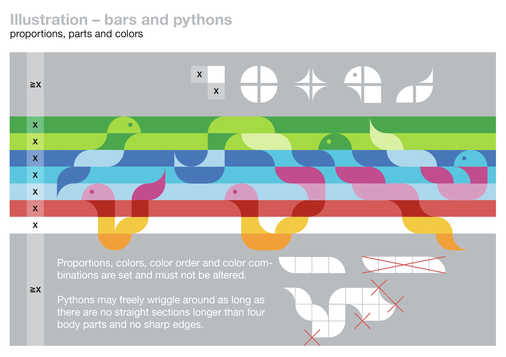

# Website Guidelines

!!! warning
    This document is in part a work in progress.

## 2025 Briefing / Introduction

For 2025 we want to create a new website, because:

 - we've used the same design since 2025, and it is time for a change
 - we have a new design concept for the conference

The new design guidelines for the conference design can be found in this PDF:
[PyConDE-PyData-Konzept.pdf](../assets/images/guidelines/PyConDE-PyData-Konzept.pdf)

{ : style="width: 30%;"}

We are looking for a lean, modern, and accessible website design.

Note:
 - color combinations (page 2) contain combinations not suitable for accessibility. They will be updated.

## Website Structure

In general, we were happy with the structure of the [website in 2024](https://2024.pycon.de).

Room for improvements:

 - mobile view
 - show the latest blog posts on the front page
 - sponsor logos sizing and sponsors page
 - better integration of social media and social cards 
 - SEO improvements, the goal is if someone googles a speaker name to display the speaker's PyCon DE talk on the first page
 - integration of YouTube videos and playlists

### SEO Example

Example: [Google "Alexander Hendorf"](https://www.google.com/search?q=alexander+hendorf)

 - PyCon DE is ranked 57th on the fifth page. 
 - Other, smaller conferences appear on the first page already.

## Website Technology

We use a static website generator, because it is:

 - easier to maintain and deploy
 - easier to add content generated automatically
 - more secure
 - faster and more reliable
 - easier to collaborate on

### Pretalx

We use data from the CfP system Pretalx to generate parts of the website.

 - program
 - speakers
 - schedule

We use [`pytanis` to access the Pretalx API](https://github.com/PioneersHub/pytanis) and moderate the data.

### Website on GitHub

 - The website is hosted on AWS S3.
 - The contents is in a [private GitHub repository](https://github.com/PYCONDE/www) `PYCONDE/www`.
 - The website is generated with [Lektor](https://www.getlektor.com/)
 - The website is deployed with GitHub Actions to S3

- There is a staging website, see the link in the repository `PYCONDE/www`.

## Contents

The website contains content from multiple sources.

| **Content**        | **Description**            | **Source**  | **Added**       | **comment** |
|--------------------|----------------------------|-------------|-----------------|-------------|
| home               | Front page                 | html        | manually        |             |
| home / sponsors    | Sponsor logos              | databag     | generated       |             |
| blog               | Blog posts                 | markdown    | manually via PR |             |
| FAQs               | Frequently asked questions | markdown    | manually        |             |
| sponsors           | Sponsor information        | databag     | generated       |             |
| program (most)     | Program information        | Pretalx API | generated       |             |
| program / schedule | Schedule information       | Pretalx     | redirect        |             |
| speakers           | Speaker information        | Pretalx API | -not yet-       |             |
| info (most)        | General information        | markdown    | manually        |             |
| info / team        | Team information           | databag     | generated       |             |
| register           | Register information       | Tito        | redirect        | to inline   |

databag: JSON files manually maintained with structured data for navigation, sponsors, etc.

---
